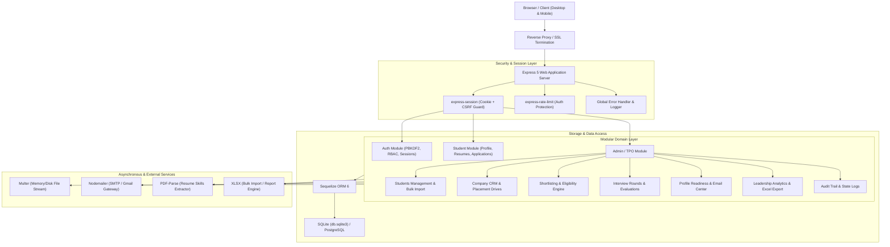
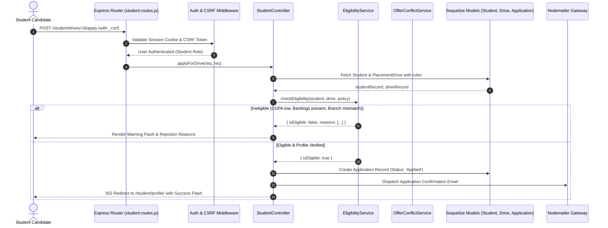

# Architecture Specification — Campus Placement Management Platform

## 1. Architectural Pattern & Dependency Rule

The platform is designed as a **Modular Domain-Driven Monolith (DDD)** adhering to the strict layered dependency rule:

$$\text{HTTP Request} \longrightarrow \text{Routes} \longrightarrow \text{Controllers} \longrightarrow \text{Services} \longrightarrow \text{Models} \longrightarrow \text{Database}$$

### Strict Layering Principles
1. **Routes Layer (`routes/`)**: Defines HTTP verbs, paths, rate-limiters, and authentication guards. No business logic or direct DB access.
2. **Controllers Layer (`controllers/`)**: Extracts, sanitizes, and validates request payloads; orchestrates service invocations; determines HTTP responses (JSON or Nunjucks template rendering).
3. **Services Layer (`services/`)**: Pure domain logic, transaction boundaries, calculation engines (eligibility rules, offer conflict resolution, resume parsing, email dispatch, Excel export).
4. **Models Layer (`db/models/`)**: Sequelize ORM definitions, associations, data types, constraints, and table hooks.

---

## 2. System Architecture Diagram

---

## 3. End-to-End Request Lifecycle: Drive Application & Eligibility Check

---

## 4. Scalability & Production Evolution Roadmap

| Component | Current Implementation | Production Scalability Strategy |
|---|---|---|
| **Session Management** | `MemoryStore` / Local Cookie Session | Migrate to distributed **Redis Store** (`connect-redis`) for multi-instance horizontal scaling. |
| **Database Engine** | SQLite (`db.sqlite3`) with additive sync | Seamlessly switch Sequelize connection string to **PostgreSQL** or **MySQL** for high concurrency and multi-tenancy. |
| **File / Media Storage** | Local File System (`media/profile_photos`, `resumes`) | Swap local Multer storage target with **AWS S3 / Google Cloud Storage** signed URLs. |
| **Performance Caching** | Direct DB count queries on dashboard | Layer in Redis caching for department counts and stats with 60s TTL or cache-invalidation on placement events. |
| **Background Processing** | In-process Async Mailer | Introduce **BullMQ / Celery** with Redis queues for large-scale bulk email broadcasts (1,000+ candidates). |
